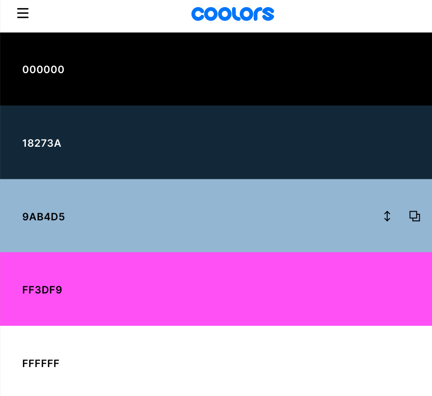

<h1 align="center">Milestone 1 Project- Dock 9 Bar</h1>

[View the live project here.](https://alexandrael9.github.io/MS1-dock9bar/index.html)

This is step one of a promotional website for Dock 9, an existing bar and brewery acquired and under new management, which is part of an exciting regeneration project in Salford Quays. The company aims are to mix old school and traditional brewing techniques and craftsmanship with modern accents in a nod to the industrial past and modern present of the area. The area has a large residential population as well as a number of creative industries, a retail shopping outlet and cultural sites such as museums, art galleries and Old Trafford Football Staduim all within walking distance of eachother and accessible by the Metrolink Tram Network. As such, the company would like to not only attract new patrons, but also begin to build itself into the heart of the community, eventually becoming a community hub.  
- This project was completed for the Milestone 1 project in Level 5 Web Application and Development. It is designed to be responsive and accessible on a range of devices, making it easy to navigate for potential and returning patrons.

<h2 align="center"></h2>

## Planning

**Target Audience**
People who live in the surrounding residential area, work in the area or are visiting as tourists to the area.

**User Goals**
- Be able to locate the bar and know opening times etc.
- Get a feel for the bar's ethos and offering through information offered by the site eg, text information, menu downloads and images.
- Be able to contact the bar with any questions and access their social media.
- Read reviews and or testimonials from previous patrons.

**Site Owner Goals**
- Showcase the bar's new look and food offerings.
- Entice patrons into the bar over other competition.
- Begin to build community with patrons through social media and newsletter subscription.

## User Experience (UX)

 ### User stories

 **First Time Visitor Goals**

1. As a First Time Visitor, I want to easily understand the main purpose of the site and learn more about the bar, its location and ethos.
2. As a First Time Visitor, I want to be able to easily navigate throughout the site to find key information about the bar.
3. As a First Time Visitor, I want to be able to look at images and menus to help me decide if this is a place I would want to visit.
4. As a First Time Visitor, I want to be able to locate linked social media to find more information from other sources, for example, reviews and comments of customers.

  **Returning Visitor Goals**

1. As a Returning Visitor, I want to find the best way to get in contact with the organisation with any questions I may have about events or to make bookings.
2. As a Returning Visitor, I want to find prices for menu items and view the menu before my visit or direct this information to my friends.
3. As a Returning Visitor, I want to locate their social media links to join their followings on social media. 

  **Frequent User Goals**
1. As a Frequent User, I want to check to see if there are any newly added images added to the gallery from an event I attended.
2. As a Frequent User, I want to check to see if there are any new products or menu items.
3. As a Frequent User, I want to be able to sign up to updates about what is going on at the bar and be the first to know about any promotional offers.

**Features To Achieve These Goals**

- The website uses responsive design so it can be seen on different devices easily. 
- The site has a navigation bar so movement from 1 page to another is simple. Similarly, the footer has links to social media. 
- The site is set up so the most basic information is accessible first (who, what, where, when) with added details on subsequent pages. 
- The site color scheme matches the design of the bar's upgrade and branding so users see the site as an extension of the bar and vice versa creating synergy and allowing the user to feel what the bar is/ may be like. 
- The site pages include page specific reviews, linked to the page content so users can see positive reviews of the section they are currently reading. 
- There is a contact form making interaction easy. 
- There are downloadable menus with prices so patrons can look and check at their leisure, prior to visit. 
- Each page has a subscribe to the newsletter section, encouraging patrons to keep in touch with the bar. 

 ### Design

**Colour Scheme**

-#18273A, a dark navy blue.  Used  mostly for title/header sections  
-#9AB4D5, a lighter blue. Mostly used for main content sections to contrast with the dark blue whilst keeping the theme.  
-#ff3df9, a neon pink. Used for highlights, outlines, buttons etc. 
-White and black were used in the navbar and footer and in typography for contrast.

- The two shades of blue are a nod to traditional 'heritage' colours of old fashioned pubs, the navy blue especially referencing the nautical and industrial past of the area. A dark and light shade were chosed so they could be used to 'section off' parts of the webpage. 
- The bright, neon pink is a quirky reference the the area's current iteration as a culture and media hub, referencing the neon lights of the BBC and ITV buildings and the Lowry Theatre shining and bouncing off the water of the Quays. 
- Black is used for the navbar and footer, giving the site pages a clear top and bottom/ start and end point.

#### Typography
- The Roboto font is the main font used throughout the whole website with Sans Serif as the back-up font in case Roboto isn't being imported into the site correctly. Roboto is a clean and simple font which is clear and easy to read used frequently so it is both attractive and fit for purpose.

#### Imagery
-   The large, background hero image of a neon bar sign is striking and catch the user's attention, providing immediate impact. It also has a modern aesthetic and makes the context of the site clear straight away.

* ### Wireframes
I used [Balsamiq Wireframes](https://balsamiq.com/wireframes/) to create wireframes before starting the project to help me plan the layout and flow of the project. 
When I was creating my website, the design plan was changed. Having never done the process before and lacking experience, my first designs were far to simple and lacking content and I had more time to add extra features to the site to add value, for examle, adding page specific reviews with images and a subscription form on every page.

 ### Homepage Wireframes

- [**Desktop**](./wireframes/home-desktop.png)
- [**Tablet**](./wireframes/home-tablet.png)
- [**Mobile**](./wireframes/home-mobile.png)

#### Gallery Page Wireframes

- [**Desktop**](./wireframes/gallery-page-desktop.png)
- [**Tablet**](./wireframes/gallery-page-tablet.png)
- [**Mobile**](./wireframes/gallery-page-mobile.png)

#### Contact Page Wireframes

- [**Desktop**](./wireframes/contact-page-desktop.png)
- [**Tablet**](./wireframes/contact-page-tablet.png)
- [**Mobile**](./wireframes/contact-page-mobile.png)

#### Menus Page Wireframes

- [**Desktop**](./wireframes/menus-page-desktop.png)
- [**Tablet**](./wireframes/menus-page-tablet.png)
- [**Mobile**](./wireframes/menus-page-mobile.png)

## Technologies Used

### Languages Used

-   [HTML5](https://en.wikipedia.org/wiki/HTML5)
-   [CSS3](https://en.wikipedia.org/wiki/Cascading_Style_Sheets)

### Frameworks, Libraries & Programs Used

1. [Bootstrap 4.1.3:](https://getbootstrap.com/docs/4.1/getting-started/introduction/)
- Bootstrap was used to assist with the responsiveness and styling of the website.
2. [Google Fonts:](https://fonts.google.com/)
- Google fonts were used to import the 'Roboto' font into the style.css file which is used on all pages throughout the project.
3. [Font Awesome:](https://fontawesome.com/)
- Font Awesome was used on all pages throughout the website to add icons for aesthetic and UX purposes.
4. [jQuery:](https://jquery.com/)
- jQuery came with Bootstrap to make the navbar responsive.
5. [Git](https://git-scm.com/)
- Git was used for version control by utilizing the Gitpod terminal to commit to Git and Push to GitHub.
6. [GitHub:](https://github.com/)
- GitHub is used to store the projects code after being pushed from Git.
7. [Balsamiq:](https://balsamiq.com/)
- Balsamiq was used to create the wireframes as part of the design process.

## Testing

- Tested navigation bar links. Home, Gallery, Contact and Menus pages jump to the respective places when clicked.

- Tested gallery controls checking carousel only moves on as a result of user input.

- Tested all social media links in the footer to ensure they open in a new tab with the correct destination when clicked.

- Tested the form on the Contact page. All required fields worked and the submission button worked.
- Tested the subscription form. All required fields worked and the submission button worked.
- Tested with different browsers such as Chrome, Firefox, and Safari.
- Tested with different screen sizes using the developer tool (Galaxy Fold, iPad, and my laptop)
    - - The site uses bootstrap across all pages to use a 1, 2, or 3 column layout. One column for small screen sizes, 2 columns for medium screen sizes and 3 columns for large screen sizes. 
**Homepage**
- [**Top Page View**](./docs/responsive-home-1.png)
- [**Middle/Bottom Page View**](./docs/responsive-home-2.png)

### Validator Testing

The W3C Markup Validator and W3C CSS Validator Services were used to validate every page of the project to ensure there were no syntax errors in the project.

**HTML**

-   [W3C Markup Validator](https://jigsaw.w3.org/css-validator/#validate_by_input) - [Results](/docs/testing/w3c-html-validator.png)

**CSS**
-   [W3C CSS Validator](https://jigsaw.w3.org/css-validator/#validate_by_input) - [Results](/docs/testing/w3c-css-validator-1.png)
-This brought the above error. I rectified it and retested. - [Results](/docs/testing/w3c-css-validator-2.png)

### Chrome's DevTools Audit Report

The Google Page-speed Services were used to assess the accessibiity of the project to ensure the site met expected accessible standards on desktop and mobile.

-SEO score could be improved by adding a meta description tag to the head. 
-Page performance is an issue- possibly down to the large size of the main image on the site.

### Lighthouse DevTools Audit Report

Lighthouse was used to assess the accessibiity of the project to ensure the site met expected accessible standards on desktop and mobile.

-SEO score could be improved by adding a meta description tag to the head. 
-Page performance is an issue- possibly down to the large size of the main image on the site.

### Testing User Stories from User Experience (UX) Section

- #### First Time Visitor Goals
1. As a First Time Visitor, I want to easily understand the main purpose of the site and learn more about the bar, its location and ethos. 
**1a.** Upon entering the site, users are automatically greeted with a clean and easily readable navigation bar to go to the page of their choice. Underneath there is a Hero Image with Text making the sites content and purpose clear. 
- The main basic information is put across first (who,what,where,when) 

2. As a First Time Visitor, I want to be able to easily navigate throughout the site to find key information about the bar. 
**2a** The user has options, use the navigation bar to enter specific site pages scroll down to read more generic info about the bar, subscribe to recieve newsletters or finally,to view the bar's social media through the links in the footer.

3. As a First Time Visitor, I want to be able to look at images and menus to help me decide if this is a place I would want to visit. 
**3a** The site has 2 pages dedicated to this information accessed from the navbar. Page content specific reviews are on each page so patrons see a relevent review to the content they are reading about.

4. As a First Time Visitor, I want to be able to locate linked social media to find more information from other sources, for example, reviews and comments of customers. 
**4a** The site includes a footer on every page with links to relevent social media.

- #### Returning Visitor Goals
1. As a Returning Visitor, I want to find the best way to get in contact with the organisation with any questions I may have about events or to make bookings. 
**1a** The website has a Contact Us page easily accessible from the navbar.

2. As a Returning Visitor, I want to find prices for menu items and view the menu before my visit or direct this information to my friends. 
**2a** From the navbar and so from any page, customers can view a dedicated Menus page with buttons to access copies of the menus with prices.

3. As a Returning Visitor, I want to locate their social media links to join their followings on social media. 
**3a** The site includes a footer on every page with links to relevent social media. 

- #### Frequent User Goals
1. As a Frequent User, I want to check to see if there are any newly added images added to the gallery from an event I attended. 
**1a** Currently, there is a dedicated gallery page with a carousel of images. This could be adapted as the site builds to become filterable by newest/oldest or by night/event.
2. As a Frequent User, I want to check to see if there are any new products or menu items. 
**2a** The dedicated menu page has up to date menus. This page could be enhanced with a "Coming Soon!" section for new/ seasonal menus. Customers can also choose to be kept up to date via the newsletter subscription.

3. As a Frequent User, I want to be able to sign up to updates about what is going on at the bar and be the first to know about any promotional offers. 
**3a** As per the companies wish to have a way to reach out to their customers, each page includes a form through which customers can sign up to a newsletter subscription.

### Further Testing

-   The Website was tested on Google Chrome, Internet Explorer, Microsoft Edge and Safari browsers.
-   The website was viewed on a variety of devices such as Desktop, Laptop, iPhone7, iPhone 8 & iPhoneX. In early building, testing showed that there were white spaces at the botton and sides in some device sizes.
-   A large amount of repeated testing was done to ensure that all pages were linking correctly.
-   Friends and family members were asked to review the site and documentation to point out any bugs and/or user experience issues.

### Known Bugs

- Performance needs to be enhanced, especially load time, and investigation work done around images slowing things down

### Improvements/ scalability 
- Improve load performance.
- improve SEO score through addin a meta description tag.
- **Gallery Page** as image library grows, consider grouping images into albulms/ folders and adding search or filtering/ sorting functions.
- **Menus Page** Add content for special/ seasonal menus to create buzz and excitement.
- **Frequent Users** Reward frequent customers and visitors to the site with special offers accessed through the website.

## Deployment

### GitHub Pages

### Forking the GitHub Repository

### Making a Local Clone

## Credits

### Code

-   [Bootstrap4](https://getbootstrap.com/docs/4.4/getting-started/introduction/): Bootstrap Library used throughout the project mainly to make site responsive using the Bootstrap Grid System. Bootstrap was also used as the gase code for the forms, jumbotron the image carousel.

- I referred to  the [W3 schools](https://www.w3schools.com/html/default.asp) website's HTML and CSS sections in order to check syntax.
- I also referred to [StackOverflow] (https://stackoverflow.com/)
- To make the navigation bar I adapted the code from the Whiskey Drop Tutorial. I also adapted the jumbotron base code to my own needs.  

### Content

-   All content was written by the developer unless otherwise stated in the credits.

### Media
- Google Map (Used a screenshot of Salford Quays with a pin drop and added to the home page 'General Info section ) 
- Images were sourced from [Unsplash](https://unsplash.com/)

### Acknowledgements

-   My Mentor Excellence Ilesanmi for continuous helpful feedback.
-   My tutor from EKC Group Rachel Furlong for support in Tutor meetings.
-   The Code Institute Slack Channel.